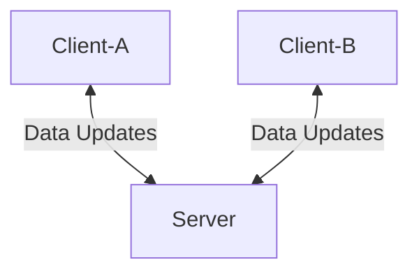

# turbo-guacamole

In-memory distributed cache

# Overview

turbo-guacamole(turbo-guac, or t-guac) is a set of tools which allow
distributed applications to cache data locally(i.e. in-memory) and that data be
in sync with other applications that use the same data. One use case is
a distributed micro-service application with more than one instance running
which needs to utilized cached data. If each instance has its own localized
cache with no knowledge of each other the caches can get out of sync and contain
incorrect data. turbo-guacamole allows all instances to be able to use data close
to the application for fast access and have the data be correct.

# Architecture

There are two components in the architecture:

1. Client - library which keeps the cached data local to the running process
allowing it to be accessed and ensuring the data is consistent with other
associated caches

2. Server - a long running process which manages the data within its own
process. This serves as the source of truth to the data and ensures that
clients which are associated have the same data.

***Note***

Future iterations intend to allow clients to run in two different modes:

1. `Client Server` - A server is required and manages the data. Each caches
connects and communicates with a server for changes to the underlying data.

2. `Adhoc` - Clients connect to each other and data is managed without a server

Right now only `Client Server` is being introduced and maintained

# TODOs

[x] Create initial CI jobs
[x] Create initial project layout
[ ] Create initial cache struct with functionality
[ ] Add Time To Live(TTL) to cache entries
[ ] Add connectivity to cache
[ ] Add messaging communication
[ ] Add functionality to dump data which will help with verifying the cache
    contents over time
